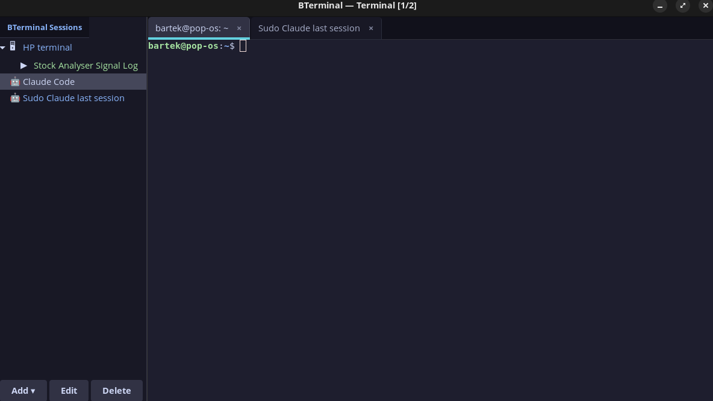

# BTerminal

Terminal with session panel (MobaXterm-style), built with GTK 3 + VTE. Catppuccin Mocha theme.

> **v2 Phases 1-7 + Multi-Machine (A-D) complete:** Multi-session Claude agent dashboard using Tauri 2.x + Svelte 5. Features: multi-pane terminal with PTY backend and copy/paste, agent panes with structured output, tree visualization with subtree cost and session resume, **subagent/agent-teams support** (auto-spawns child panes for subagents with parent/child navigation and recursive cost aggregation), **multi-machine support** (bterminal-relay WebSocket server + RemoteManager for managing agents/terminals on remote machines), session groups/folders with collapsible sidebar headers, SSH session management, ctx context database viewer, SQLite session persistence with layout restore, live markdown file viewer with Shiki syntax highlighting, global status bar with cost tracking, toast notifications, settings dialog with theme flavors (Catppuccin Latte/Frappe/Macchiato/Mocha) and live hot-swap, detached pane mode (pop-out windows), pane drag-resize handles, auto-updater plugin with signing key configured, @anthropic-ai/claude-agent-sdk integration, unified sidecar bundle (Deno-first, Node.js fallback), CSS Grid tiling, .deb + AppImage packaging, GitHub Actions CI, 114 vitest + 29 cargo tests. Branch `v2-mission-control`. See [docs/task_plan.md](docs/task_plan.md) for architecture and [docs/phases.md](docs/phases.md) for implementation plan.



## Features

- **SSH sessions** — saved configs (host, port, user, key, folder, color), CRUD with side panel
- **Claude Code sessions** — saved Claude Code configs with sudo, resume, skip-permissions and initial prompt
- **SSH macros** — multi-step macros (text, key, delay) assigned to sessions, run from sidebar
- **Tabs** — multiple terminals in tabs, Ctrl+T new, Ctrl+Shift+W close, Ctrl+PageUp/Down switch
- **Sudo askpass** — Claude Code with sudo: password entered once, temporary askpass helper, auto-cleanup
- **Folder grouping** — SSH and Claude Code sessions can be grouped in folders on the sidebar
- **ctx — Context manager** — SQLite-based cross-session context database for Claude Code projects
- **Catppuccin Mocha** — full theme: terminal, sidebar, tabs, session colors

## Installation

```bash
git clone https://github.com/DexterFromLab/BTerminal.git
cd BTerminal
./install.sh
```

The installer will:
1. Install system dependencies (python3-gi, GTK3, VTE)
2. Copy files to `~/.local/share/bterminal/`
3. Create symlinks: `bterminal` and `ctx` in `~/.local/bin/`
4. Initialize context database at `~/.claude-context/context.db`
5. Add desktop entry to application menu

### v2 Installation (Tauri — build from source)

Requires Node.js 20+, Rust 1.77+, and system libraries (WebKit2GTK 4.1, GTK3, etc.).

```bash
git clone https://github.com/DexterFromLab/BTerminal.git
cd BTerminal
./install-v2.sh
```

The installer checks all dependencies, offers to install missing system packages via apt, builds the Tauri app, and installs the binary as `bterminal-v2` in `~/.local/bin/`.

Pre-built .deb and AppImage packages are available from [GitHub Releases](https://github.com/DexterFromLab/BTerminal/releases) (built via CI on version tags).

### v1 Manual dependency install (Debian/Ubuntu/Pop!_OS)

```bash
sudo apt install python3-gi gir1.2-gtk-3.0 gir1.2-vte-2.91
```

## Usage

```bash
bterminal
```

## Context Manager (ctx)

`ctx` is a SQLite-based tool for managing persistent context across Claude Code sessions.

```bash
ctx init myproject "Project description" /path/to/project
ctx get myproject                    # Load full context (shared + project)
ctx set myproject key "value"        # Save a context entry
ctx shared set preferences "value"   # Save shared context (available in all projects)
ctx summary myproject "What was done" # Save session summary
ctx search "query"                   # Full-text search across everything
ctx list                             # List all projects
ctx history myproject                # Show session history
ctx --help                           # All commands
```

### Integration with Claude Code

Add a `CLAUDE.md` to your project root:

```markdown
On session start, load context:
  ctx get myproject

Save important discoveries: ctx set myproject <key> <value>
Before ending session: ctx summary myproject "<what was done>"
```

Claude Code reads `CLAUDE.md` automatically and will maintain the context database.

## Configuration

Config files in `~/.config/bterminal/`:

| File | Description |
|------|-------------|
| `sessions.json` | Saved SSH sessions + macros |
| `claude_sessions.json` | Saved Claude Code configs |

Context database: `~/.claude-context/context.db`

## Keyboard Shortcuts

| Shortcut | Action |
|----------|--------|
| `Ctrl+T` | New tab (local shell) |
| `Ctrl+Shift+W` | Close tab |
| `Ctrl+Shift+C` | Copy |
| `Ctrl+Shift+V` | Paste |
| `Ctrl+PageUp/Down` | Previous/next tab |

## Multi-Machine Support (v2)

BTerminal v2 can manage agents and terminals running on remote machines via the `bterminal-relay` binary.

### Architecture

```
BTerminal (Controller) --WebSocket--> bterminal-relay (Remote Machine)
                                      ├── PtyManager (remote terminals)
                                      └── SidecarManager (remote agents)
```

### Running the Relay

On each remote machine:

```bash
# Build the relay binary
cd v2 && cargo build --release -p bterminal-relay

# Start with token auth
./target/release/bterminal-relay --port 9750 --token <secret>

# Dev mode (allow unencrypted ws://)
./target/release/bterminal-relay --port 9750 --token <secret> --insecure
```

Add remote machines in BTerminal Settings > Remote Machines (label, URL, token). Remote panes auto-group by machine label in the sidebar. Connections automatically reconnect with exponential backoff (1s-30s cap) on disconnect.

See [docs/multi-machine.md](docs/multi-machine.md) for full architecture details.

## Documentation

| Document | Description |
|----------|-------------|
| [docs/task_plan.md](docs/task_plan.md) | v2 architecture decisions, error handling, testing strategy |
| [docs/phases.md](docs/phases.md) | v2 implementation phases (1-7 + multi-machine A-D) with checklists |
| [docs/findings.md](docs/findings.md) | Research findings (Agent SDK, Tauri, xterm.js, performance) |
| [docs/progress.md](docs/progress.md) | Session-by-session progress log (recent) |
| [docs/progress-archive.md](docs/progress-archive.md) | Archived progress log (2026-03-05 to 2026-03-06 early) |
| [docs/multi-machine.md](docs/multi-machine.md) | Multi-machine architecture (implemented, WebSocket relay, reconnection) |

## License

MIT
